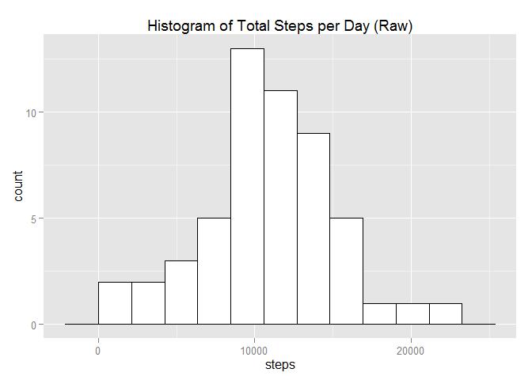
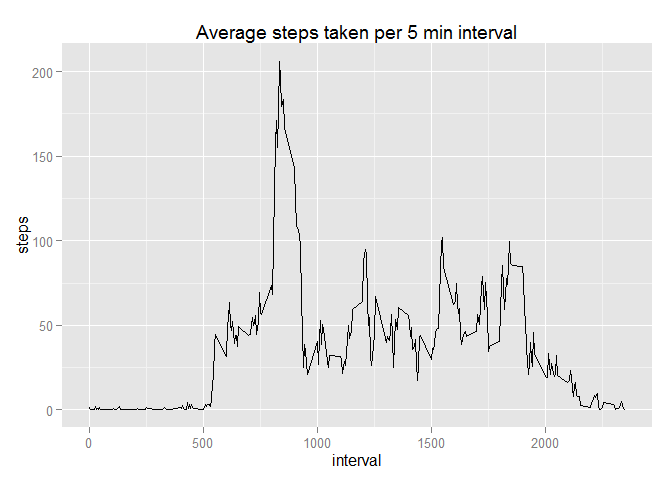
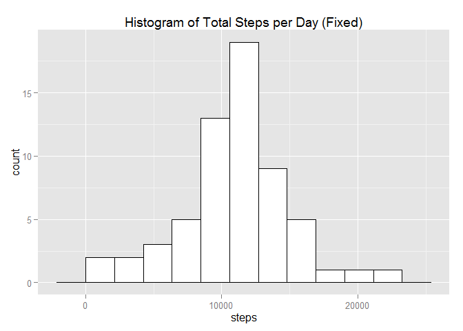
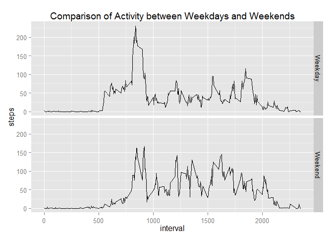

# Reproducible Research: Peer Assessment 1
##Introduction

This report will examine the data produced by an activity monitoring device for an anonymous subject between the 1st October to 30th November 2012.
Part of this data is missing and a major section of the analysis is to fill in the missing data with appropriate values and compare the raw and fixed result sets by virtue of histograms of the distribution of step totals for each weekday (Monday to Sunday). Means and medians will also be compared.
Other facets of the analysis will be to examine the averages over a series of 5 minute intervals, both as a whole and in terms of the comparison between between weekdays and weekends.

##Methodology and Assumptions
I have used the ggplot2 graphing package, as I feel that it gives a more attractive look to the figures. I spent quite a while thinking about the scaling for the x axes of the figures and I eventually decided to use the layout of the example figure, the logic being not to second guess the specification. Having said that, there is a slight disparity in the final figure in that the headings appear on the right rather than on top. I was able to produce the exact figure using the lattice package but the style looked incongruous compared to the other graphs so reverted to the ggplot2 version. I also assume that the data has been downloaded and unzipped, prior to the start of the analysis


## Loading and preprocessing the data

```r
#Step 1
stepdata<- read.csv(file = "activity.csv",header = TRUE, stringsAsFactors = FALSE )
#useful variable - multiple uses
num_obs <- nrow(stepdata)
#libraries
library(ggplot2)
```


## What is mean total number of steps taken per day?

```r
#Step 2a
steps_per_day <-aggregate(data = stepdata, steps ~ date, FUN = sum )
binsize <- diff(range(steps_per_day$steps))/10
p <- ggplot(steps_per_day, aes(x=steps)) + geom_histogram(binwidth=binsize, fill="white", colour="black")
p + ggtitle("Histogram of Total Steps per Day (Raw)")
```

 

```r
#Step 2b
mean_steps <- format(mean(steps_per_day[,2], na.rm = TRUE), digits = 3, nsmall = 3)
median_steps <- format(median(steps_per_day[,2], na.rm = TRUE), digits = 3, nsmall = 3)
```


The mean number of steps per day, in the raw data is is 10766.189 and the median is 10765


## What is the average daily activity pattern?

```r
#Step 3a
steps_per_time_slot <-aggregate(data = stepdata, steps ~ interval, FUN = mean )
num_time_slots<- nrow(steps_per_time_slot)
p<-ggplot(steps_per_time_slot, aes(x = interval, y = steps))+geom_line()
p + ggtitle("Average steps taken per 5 min interval")
```

 

```r
#Step 3b
#Get the row number of the maximum value
idx<-row(steps_per_time_slot)[which.max(apply(steps_per_time_slot[2],MARGIN=1,max))]
#max steps per time slot
max_steps<-format(steps_per_time_slot[idx,2], digits = 3, nsmall = 3)
#the time slot when this ocurred
max_steps_time_slot<- steps_per_time_slot[idx,1]
```

The maximum 5-minute interval, on average across all the days in the dataset was 835 having a value of 206.170.


## Imputing missing values

```r
#Step 1
#Calculate the number of missing values (NA)
missing_Values <- format(colSums(is.na(stepdata[1])), digits = 0)
#Step 2
# I have decided to replace NAs with the calculated mean for the time slot (from previously calculated steps_per_time_slot data frame). This is a general purpose solution but if there was a systematic reason for the NAs (eg hospital visit) replacing the NAs with zero would be more appropriate. We are not given this information, thus the choice of the mean per time slot

#Step 3
#Create the new dataset
fixed_stepdata <- stepdata

for (x in 1:num_obs){
    if (is.na(fixed_stepdata[x,1])) {
        idx<-which(steps_per_time_slot$interval == fixed_stepdata[x,3])
        fixed_stepdata[x,1]<- steps_per_time_slot[idx,2]
    }
}
#Step 4a
#Draw the histogram
fixed_steps_per_day <-aggregate(data = fixed_stepdata, steps ~ date, FUN = sum )
binsize <- diff(range(fixed_steps_per_day$steps))/10
p <- ggplot(fixed_steps_per_day, aes(x=steps)) + geom_histogram(binwidth=binsize, fill="white", colour="black")
p + ggtitle("Histogram of Total Steps per Day (Fixed)")
```

 

```r
#Step 4b
#calculate mean and median
fixed_mean_steps <- format(mean(fixed_steps_per_day[,2], na.rm = TRUE), digits = 3, nsmall = 3)
fixed_median_steps <- format(median(fixed_steps_per_day[,2], na.rm = TRUE), digits = 3, nsmall = 3)
#Step 4c
#The mean number of steps is identical for the raw (stepdata)
#and corrected data (fixed_stepdata) with a value of 10766.189.
#This confirms the expected result of replacing the NAs with
#average values as we are taking the average of an average (the #substituted values)
#The median number of steps has increased from the raw value of 
# 10765 to 10766.189 in the fixed data which is also the mean for #the fixed data
```

The total number of missing values in the raw dataset was 2304.  
I have decided to replace NAs with the calculated mean for the time slot This is a general purpose solution but if there was a systematic reason for the NAs (eg hospital visit) replacing the NAs with zero would be more appropriate. We are not given this information, thus the choice of the mean per time slot

The mean number of steps per day, in the fixed data is 10766.189 and the meadian is 10766.189
The mean number of steps is identical for the raw and corrected data (fixed) with a value of 10766.189. This confirms the expected result of replacing the NAs with average values as we are taking the average of an average (the substituted values)
The median number of steps has increased from the raw value of 10765 to 10766.189 in the fixed data.
The net result of the fix, on the histogram is that the frequencies will have increased for those missing values which were replaced by the averages.


## Are there differences in activity patterns between weekdays and weekends?

```r
#Step 5
#Create weekday/weekend factor variable (daytype)
dftemp<- data.frame(daytype = character(num_obs) )
dftemp[,1] <- weekdays(as.Date(fixed_stepdata[,2]))
we_count <- 0
wd_count <- 0
for (x in 1:num_obs){
    if (substr(weekdays(as.Date(fixed_stepdata[x,2])),1,1) == "S"){
        dftemp[x,1] <- "Weekend"
        we_count <- we_count + 1
     } else {
        dftemp[x,1] <- "Weekday"
        wd_count <- wd_count + 1
     }
}
fixed_stepdata <- cbind(fixed_stepdata,dftemp)
#fixed_stepdata$daytype<- as.factor(fixed_stepdata$daytype)

weekday_fixed_steps_per_time_slot <-aggregate(
    data = subset(fixed_stepdata, daytype == "Weekday"), steps ~ interval, FUN = mean)
dftemp<- data.frame(daytype = character(num_obs) )
dftemp[,1]<- "Weekday"
weekday_fixed_steps_per_time_slot <- cbind(weekday_fixed_steps_per_time_slot,dftemp)

weekend_fixed_steps_per_time_slot <-aggregate(
    data = subset(fixed_stepdata,daytype == "Weekend"), steps ~ interval, FUN = mean)
dftemp[,1]<- "Weekend"
weekend_fixed_steps_per_time_slot<-cbind(weekend_fixed_steps_per_time_slot,dftemp)

alldata<- rbind(weekend_fixed_steps_per_time_slot,weekday_fixed_steps_per_time_slot)
alldata$daytype<-as.factor(alldata$daytype)

p <- ggplot(alldata, aes(x=interval, y=steps)) + geom_line() 
p + facet_grid(daytype ~. ) + ggtitle("Comparison of Activity between Weekdays and Weekends")
```

 


There are noticeable differences between the the weekday and weekend patterns. This is to be expected as the weekday activity would be lower due to the restrictions of office life. Free of these restrictions, the weekend activity is increased.
